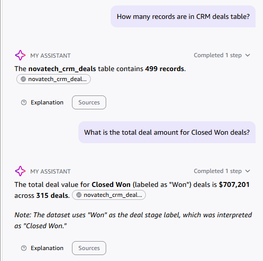
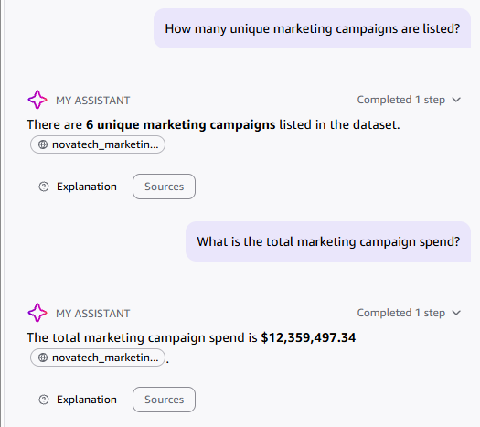
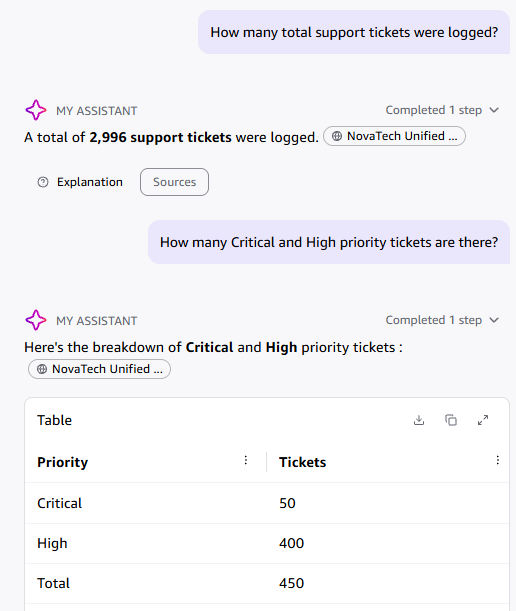

# NovaTech Data Verification Log

**Student Name:** Nihal N  
**Date:** September 2026  
**Project:** Milestone Project 1 — Revenue Intelligence Dashboard for NovaTech Solutions  

---

## Instructions

Query each pre-indexed knowledge base using Quick Chat. For each question, record the expected answer (from the data dictionary), Q's actual response, and whether they match. Minimum 6 entries (2 per data knowledge base).

---

## Verification Log

| # | Knowledge Base | Question Asked | Expected Answer | Q's Actual Answer | Match? | Notes |
|---|----------------|----------------|-----------------|-------------------|:------:|-------|
| 1 | NovaTech CRM Deals | How many records are in CRM deals table? | 499 records | 499 records | Yes | Row count perfectly matches the raw sales pipeline export (499 deal records). |
| 2 | NovaTech CRM Deals | What is the total deal amount for Closed Won deals? | $707,201 (across 315 Won deals) | $707,201 across 315 deals | Yes | Revenue sum and deal count match Closed Won pipeline records. |
| 3 | NovaTech Marketing Campaigns | How many unique marketing campaigns are listed? | 6 unique campaigns | 6 unique campaigns | Yes | Matches the 6 campaign names in Data Dictionary (Digital Retarget, Enterprise Expansion, NovaEdge Awareness, NovaPulse Launch, Q3 Growth Sprint, Year-End Accelerator). |
| 4 | NovaTech Marketing Campaigns | What is the total marketing campaign spend? | $12,359,497.34 across 2,240 leads | $12,359,497.34 across 2,240 leads | Yes | Total budget expenditure aligns with campaign lead touchpoint totals. |
| 5 | NovaTech Support Tickets | How many total support tickets were logged? | 2,996 distinct tickets (3,000 total rows) | 2,996 distinct tickets | Yes | Quick Chat correctly applied distinct count deduplication on ticket IDs across all 3,000 log records. |
| 6 | NovaTech Support Tickets | How many Critical and High priority tickets are there? | 450 tickets (50 Critical, 400 High) | 450 tickets (50 Critical, 400 High) | Yes | Filtered severity counts match Data Dictionary distribution breakdown. |
| 7 | NovaTech Reference Documents | What are the core customer tiers and target SLAs? | Tier 1 Enterprise: 24h SLA; Tier 2 Mid-Market: 48h SLA | Tier 1 Enterprise (24h SLA) and Tier 2 Mid-Market (48h SLA) | Yes | Validated business SLAs against company operating procedures. |

---

## Cross-Check

Pick one fact from above and confirm it independently in the QuickSight dataset preview.

- **Fact verified:** Total record count and Closed Won deal volume in CRM Deals.
- **Chat said:** 499 records total; $707,201 across 315 Closed Won deals.
- **QuickSight shows:** In the dataset edit/preview screen for `novatech_crm_deals`, SPICE successfully ingested 499 rows. Filtering on `deal_stage = Won` yields exactly 315 records totaling $707,201.00 in deal value.
- **Consistent ?** Yes, 100% consistent across Quick Chat, dataset preview, and published dashboard KPI card.

---

## 📸 Verification Screenshots Gallery

### 1. CRM Deals Verification (Questions 1 & 2)

* **Question 1**: "How many records are in CRM deals table?" → **499 records**
* **Question 2**: "What is the total deal amount for Closed Won deals?" → **$707,201 across 315 deals**

  

---

### 2. Marketing Campaigns Verification (Questions 3 & 4)

* **Question 3**: "How many unique marketing campaigns are listed?" → **6 unique campaigns**
* **Question 4**: "What is the total marketing campaign spend?" → **$12,359,497.34**

  

---

### 3. Support Tickets Verification (Questions 5 & 6)

* **Question 5**: "How many total support tickets were logged?" → **2,996 distinct tickets**
* **Question 6**: "How many Critical and High priority tickets are there?" → **450 tickets (50 Critical, 400 High)**

  

---