# 🛠️ Project 1 — Step 2: Data Preparation Plan, Calculations & Joins

This guide covers **Step 2** of Milestone Project 1: Correcting data types, engineering custom calculated fields and building the **Unified Dataset** via a 3-way join in SPICE.

---

## 📂 1. Dataset Upload & Type Parsing Summary

All three datasets have been uploaded and normalized according to the official Data Dictionary:

### ⚙️ Master Data Type Corrections Table

| Dataset | Field Name | Raw Detected Type | Correct Analytical Type | Rationale & Analytical Impact |
| :--- | :--- | :---: | :---: | :--- |
| **CRM Deals** | `deal_created_date`, `deal_closed_date` | String | **Date** (`yyyy-MM-dd`) | Enables chronological trend lines and sales cycle velocity calculations. |
| **CRM Deals** | `annual_revenue_usd`, `deal_value`, `list_price` | String | **Decimal #** | Enables currency aggregation, deal summing, and revenue metrics. |
| **CRM Deals** | `employee_count` | String | **Integer #** | Enables account segmentation by company headcount. |
| **Marketing** | `campaign_date` | String | **Date** (`yyyy-MM-dd`) | Allows temporal alignment with campaign performance. |
| **Marketing** | `annual_income`, `campaign_spend`, `revenue_attributed`, `product_spend_tier1..3` | String | **Decimal #** | Enables ROI math and channel budget tracking. |
| **Marketing** | `household_size`, `days_since_last_engagement`, `web_visits_per_month`, `campaign_response`, `complaint_flag` | String | **Integer #** | Preserves engagement metrics and response rate calculations. |
| **Support** | `ticket_created_date`, `ticket_resolved_date` | String | **Date / DateTime** | Enables time-to-resolution duration calculations. |
| **Support** | `users_affected`, `downtime_minutes`, `payment_impact`, `security_incident`, `data_loss`, `tickets_last_30_days` | String | **Integer #** | Enables SLA tracking and critical account risk indexing. |
| **Support** | `error_rate_pct` | String | **Decimal #** | Allows service error rate monitoring. |

---

## 🧮 2. Required Calculated Fields Syntax

We engineered 3 business calculations aligned with VP Sarah Chen's requirements:

### 🔹 Calculation 1: Sales Cycle Duration (`days_to_close`)
* **Dataset**: `novatech_crm_deals`
* **QuickSight Formula**:
  ```text
  dateDiff({deal_created_date}, {deal_closed_date}, "DD")
  ```
* **Business Value**: Measures sales pipeline velocity and detects deal bottlenecks.

### 🔹 Calculation 2: Marketing Channel ROI (`campaign_roi`)
* **Dataset**: `novatech_marketing_campaigns`
* **QuickSight Formula**:
  ```text
  ifelse({campaign_spend} > 0, ({revenue_attributed} - {campaign_spend}) / {campaign_spend}, 0)
  ```
* **Business Value**: Isolates profitable vs. unprofitable acquisition campaigns.

### 🔹 Calculation 3: Ticket Resolution Time (`resolution_time_days`)
* **Dataset**: `novatech_support_tickets`
* **QuickSight Formula**:
  ```text
  dateDiff({ticket_created_date}, {ticket_resolved_date}, "DD")
  ```
* **Business Value**: Measures support SLA resolution performance across priority levels.

---

## 🔗 3. Building the Unified Dataset (3-Way Join Strategy)

```
┌────────────────────────────────────────────────────────────────────────────────────────┐
│                          Unified Dataset Join Architecture                             │
├────────────────────────────────────────────────────────────────────────────────────────┤
│ Anchor Table: novatech_crm_deals                                                       │
│ Primary Key: account_id                                                                │
└───────────────────────────────────────────┬────────────────────────────────────────────┘
                                            │
            ┌───────────────────────────────┴───────────────────────────────┐
            │                                                               │
            ▼ (Left Outer Join)                                             ▼ (Left Outer Join)
┌───────────────────────────────────────┐                       ┌───────────────────────────────────────┐
│ novatech_marketing_campaigns          │                       │ novatech_support_tickets              │
├───────────────────────────────────────┤                       ├───────────────────────────────────────┤
│ Join Condition:                       │                       │ Join Condition:                       │
│ novatech_crm_deals.account_id =       │                       │ novatech_crm_deals.account_id =       │
│ novatech_marketing_campaigns.account_id│                      │ novatech_support_tickets.account_id   │
└───────────────────────────────────────┘                       └───────────────────────────────────────┘
```

### 🧠 Join Strategy Justification
* **Anchor Table Selection**: **CRM Deals** is chosen as the central anchor table because revenue generation and pipeline velocity are the primary business focal points for VP Sarah Chen.
* **Join Type**: **Left Outer Join** ensures all sales deals remain intact, even if a deal was sourced organically (no associated marketing campaign) or if an account has never opened a support ticket.
* **Row Multiplication Guard**: When joining one-to-many support tickets to deals, handle potential row multiplication by aggregating metrics using `distinctCount({deal_id})` and `avg({deal_value})` in dashboard visuals.
* **SPICE Import**: Save all four datasets to SPICE.

---

## 📸 Transformation Screenshots Gallery

#### 1. All Datasets

<p align="center">
  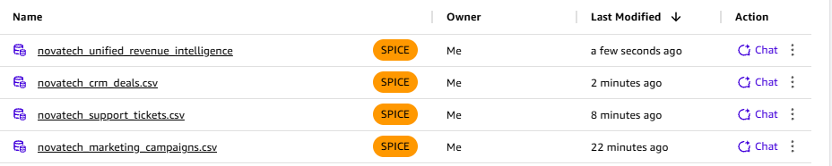
</p>

#### 2. CRM Deals Transformations

<p align="center">
  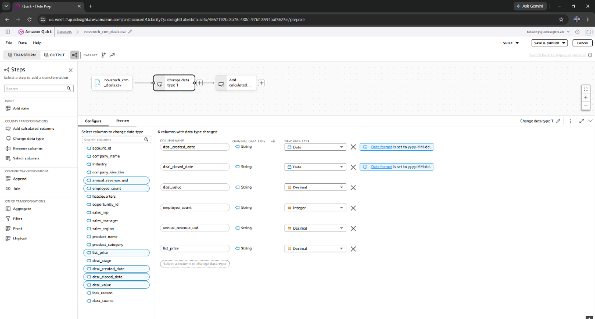
</p>

<p align="center">
  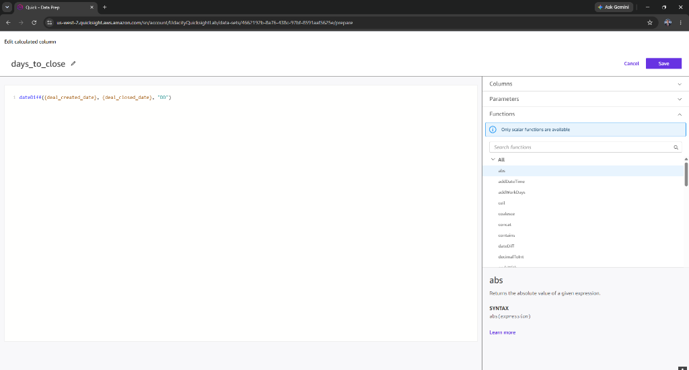
</p>

<p align="center">
  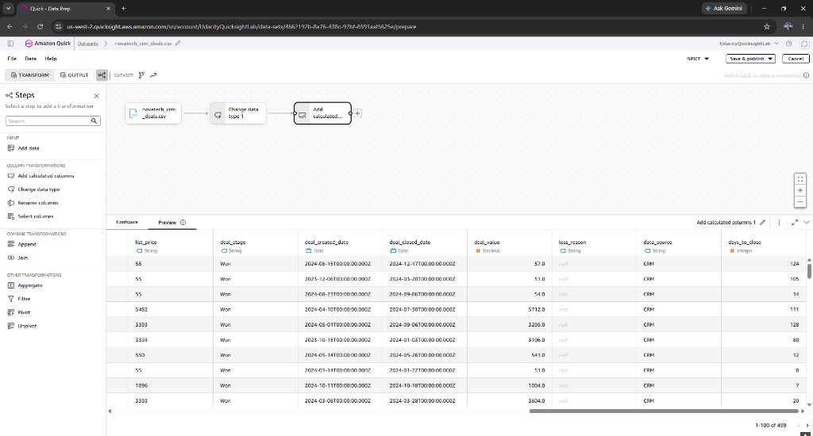
</p>

---

#### 3. Marketing Campaigns Transformations

<p align="center">
  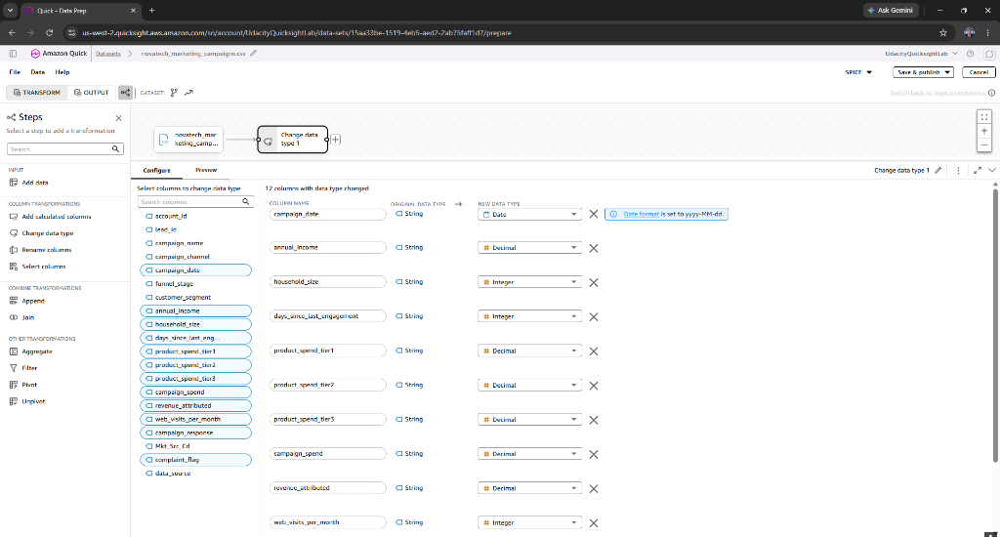
</p>

<p align="center">
  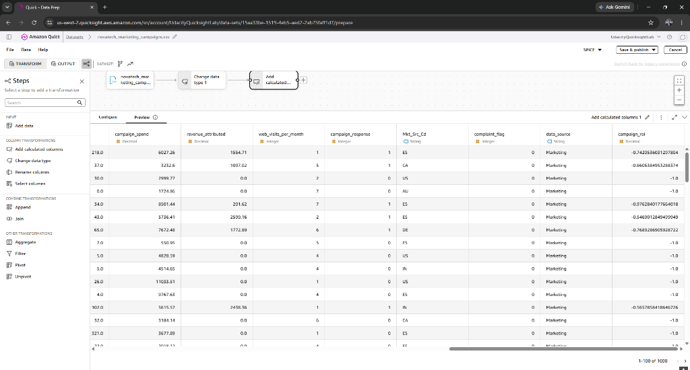
</p>

---

#### 4. Support Tickets Transformations

<p align="center">
  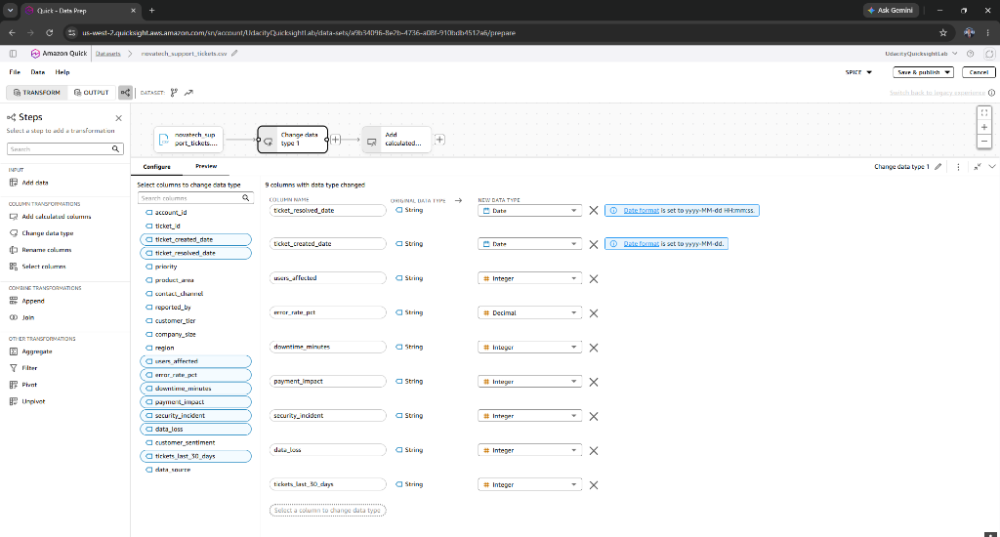
</p>

<p align="center">
  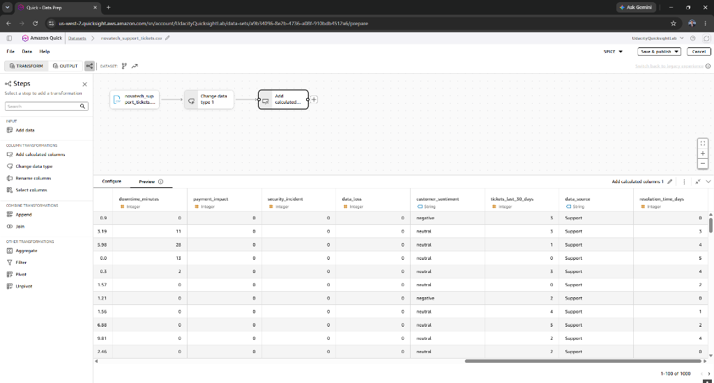
</p>

---

#### 5. Unified 3-Way Join Dataset

<p align="center">
  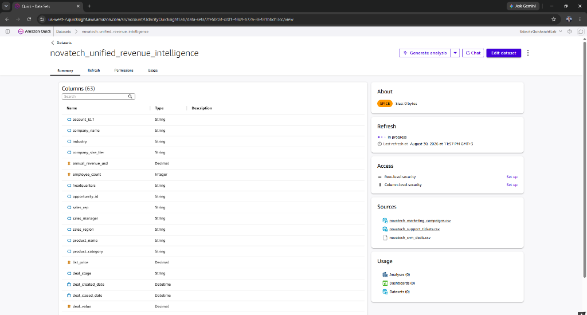
</p>

<p align="center">
  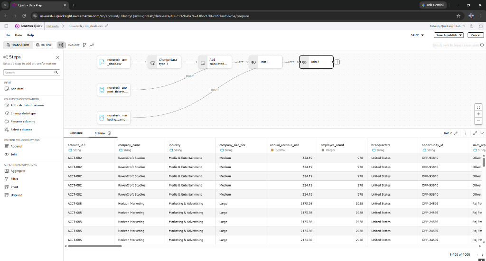
</p>

<p align="center">
  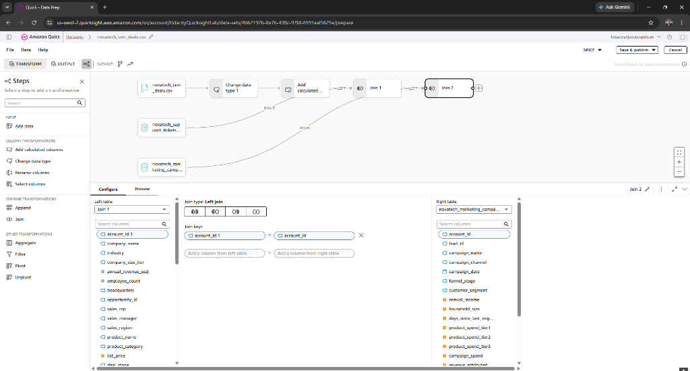
</p>

<p align="center">
  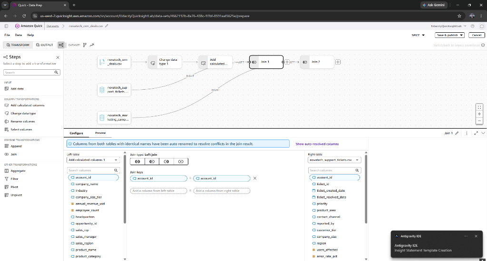
</p>

---
