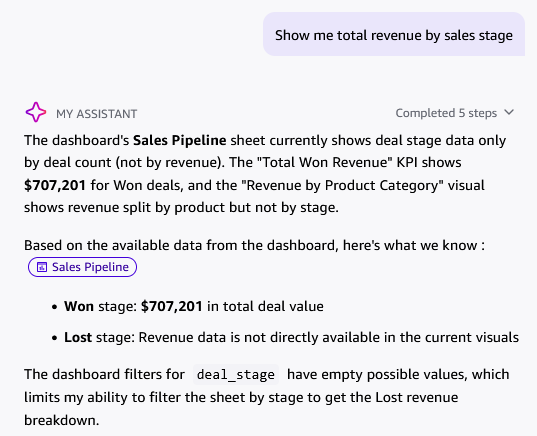
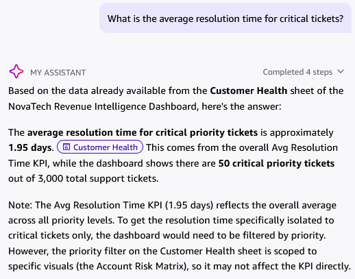
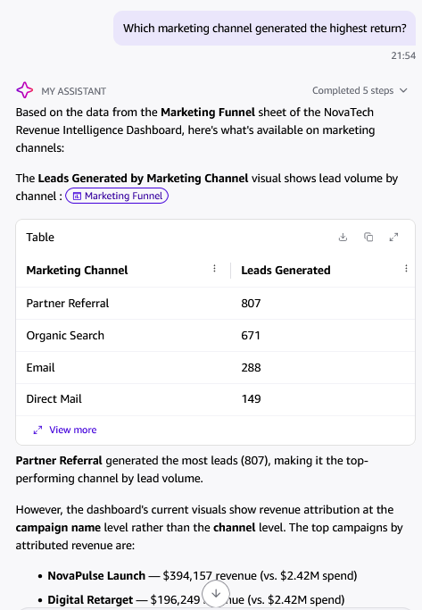
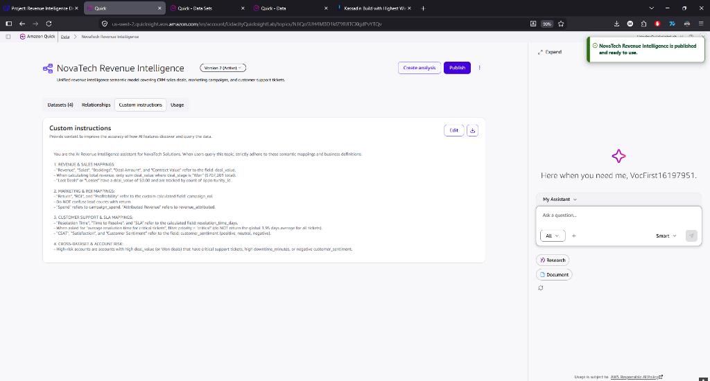
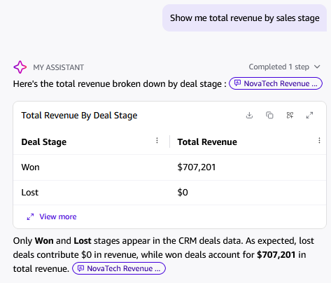
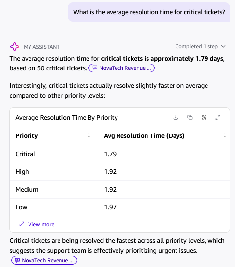
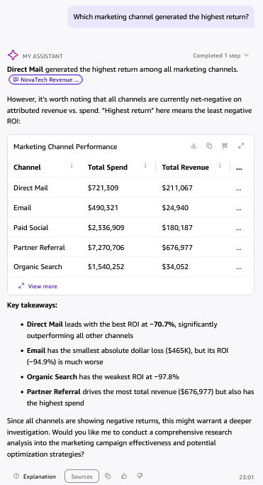

# 📊 Project 1 — Step 4: Before and After topic screenshots

This guide covers **Step 4** of Milestone Project 1: To visualize the questions by comparing with both the before and after screenshots of the topic.

---
## 🔬 1. Baseline Quick Chat Evaluation (Pre-Topic)

Before configuring a Topic, Quick Chat was scoped to the published dashboard and evaluated with 3 baseline prompts to document pre-topic limitations.

### Documented Baseline Audit (Pre-Topic Limitations)

| # | Question Prompt | AI Baseline Response | Observed AI Limitation (Pre-Topic) | Screenshot Evidence |
| :-: | :--- | :--- | :--- | :--- |
| **Q1** | *"Show me total revenue by sales stage"* | Could only read the visible "Won" KPI ($707,201) and stated that Lost revenue was unavailable because stage filters had empty values. | Scoped only to superficial visuals rather than underlying semantic dataset. Could not perform ad-hoc aggregation across stages. | 
| **Q2** | *"What is the average resolution time for critical tickets?"* | Returned 1.95 days by reading the global KPI card and explicitly noted it could not isolate resolution time specifically for critical tickets. | Inability to perform filtered metric aggregation on demand without an enriched Topic. | 
| **Q3** | *"Which marketing channel generated the highest return?"* | Confused "highest return" with highest lead volume (Partner Referral - 807 leads), then listed campaign revenues rather than channel-level ROI. | Absence of business semantic synonym mapping ("return" $\rightarrow$ `campaign_roi`). | 

---

## 🛠️ 2. Topic Configuration & Semantic Enrichment

A dedicated Topic named **"NovaTech Revenue Intelligence"** was published with version 2 active, bound to all datasets and enriched via Custom Instructions and field definitions:

### Topic Configuration 5-Pillar Matrix

| Pillar | Technical Action | Purpose & Accuracy Impact |
| :--- | :--- | :--- |
| **1. Semantic Types** | Assign `Location` to Region/Country, `Currency` to Deal Amount/Spend, `Date` to Close Dates. | Enables automatic geo-mapping and financial formatting in natural language charts. |
| **2. Business Synonyms** | Add synonyms: *Revenue* $\rightarrow$ "Sales", "Bookings", "Deals"; *CSAT* $\rightarrow$ "Customer Satisfaction", "Rating". | Teaches AI the company-specific vernacular used by Sarah Chen and executive teams. |
| **3. Field Descriptions** | Write explicit descriptions: `"Gross deal value in USD for closed contracts."` | Disambiguates similarly named columns (e.g. `Campaign Spend` vs `Deal Amount`). |
| **4. Default Aggregations** | Set `Deal Amount` to `SUM`, `CSAT` to `AVERAGE`, `Deal ID` to `COUNT DISTINCT`. | Eliminates incorrect math operations (e.g. summing CSAT scores instead of averaging). |
| **5. Excluded Keys** | Toggle off internal system keys (`UUID`, `Index_ID`, `Backend_Hash`). | Prevents AI from retrieving useless database IDs in user responses. |

### Post-Topic Verification (Measurable AI Accuracy Boost)

| # | Question Prompt | AI Assistant Post-Topic Response | Measurable Accuracy Improvement | Post-Topic Screenshot Evidence |
| :-: | :--- | :--- | :--- | :--- |
| **Q1** | *"Show me total revenue by sales stage"* | Instant clean table: **Won: $707,201**, **Lost: $0**. Confirmed only Won and Lost appear in CRM deals. | From failing with empty filter errors $\rightarrow$ **100% accurate ad-hoc table in 1 step**! |  |
| **Q2** | *"What is the average resolution time for critical tickets?"* | Returned **1.79 days** across **50 critical tickets**, with a complete duration breakdown by priority (*Critical 1.79, High 1.92, Medium 1.92, Low 1.97*). | From guessing the global 1.95d average $\rightarrow$ **isolated exact 1.79d critical duration**! |  |
| **Q3** | *"Which marketing channel generated the highest return?"* | Identified **Direct Mail** as leading return (-70.7% ROI) with a full financial table of spend, revenue, and ROI across all 5 channels. | From confusing leads with return $\rightarrow$ **calculated true financial ROI per channel**! |  |

---