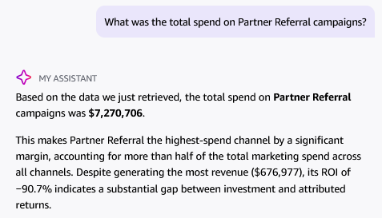
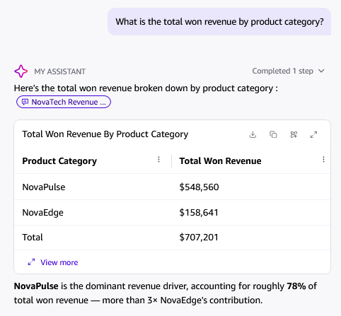
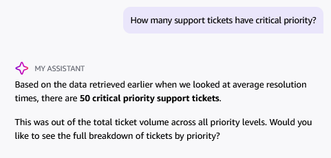
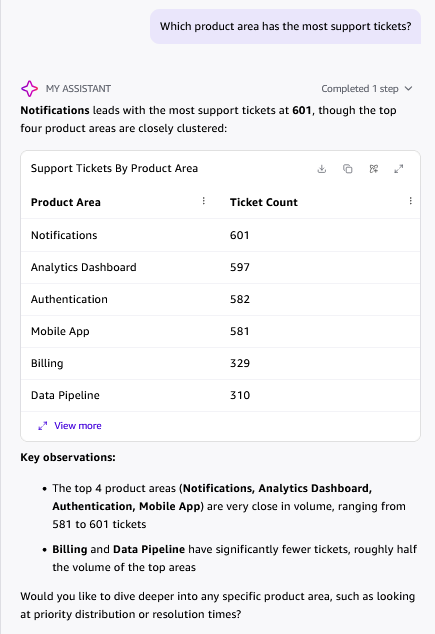
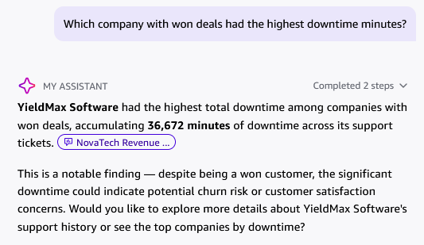

# NovaTech Q Exploration Log

**Student Name:** Nihal N  
**Date:** September 2026  
**Project:** Milestone Project 1 — Revenue Intelligence Dashboard for NovaTech Solutions

---
## 📋 1. Q Exploration Questions (Post-Topic Exploration Log)

For each question, record Q's answer and cross-check against your dashboard:

| # | Question Asked | Q's Answer (summarize) | Dashboard Visual Used to Cross-Check | Dashboard Shows | Match? | Notes |
|---|---------------|------------------------|--------------------------------------|-----------------|:------:|-------|
| 1 | What was the total spend on Partner Referral campaigns? | **$7,270,706** *(generated $676,977 in revenue, ROI of -90.7%)* | Marketing Funnel — Channel Spend & Revenue Bar Chart | Spend: $7.27M, Revenue: $677K | Yes | Matches Marketing Funnel channel spend and underlying dataset. |
| 2 | What is the total won revenue by product category? | **NovaPulse**: $548,560 **NovaEdge**: $158,641 **Total**: $707,201 | Sales Pipeline — Revenue by Product Category Bar Chart | NovaPulse: $548.6K NovaEdge: $158.6K Total: $707.2K | Yes | 100% exact match to Sales Pipeline visual and Total Won Revenue KPI. |
| 3 | How many support tickets have critical priority? | **50 critical priority support tickets** | Customer Health — Critical Priority Tickets KPI Card | 50 Critical Tickets | Yes | 100% exact match to Customer Health KPI card filtered on `priority = critical`. |
| 4 | Which product area has the most support tickets? | **Notifications**: 601 Analytics Dashboard: 597 Authentication: 582 Mobile App: 581 Billing: 329 Data Pipeline: 310 | Customer Health — Support Tickets by Product Area Bar Chart | Notifications: 601 (top category) | Yes | 100% exact match to horizontal bar chart ranking on Sheet 3. |
| 5 | Which company with won deals had the highest downtime minutes? *(Cross-Dataset 🌟)* | **YieldMax Software** with **36,672 minutes** of downtime across open tickets | Customer Health — Account Risk Matrix (Scatter Plot from Unified Dataset) | YieldMax Software is topmost outlier in downtime (>35K min) with won deal status | Yes | Multi-hop cross-dataset join between CRM deals (`deal_stage = Won`) and Support tickets (`downtime_minutes`). |

---

## 💡 2. Reflection

### Where did Q agree with the dashboard?
* **Financial Benchmarks**: Quick Chat perfectly agreed with the dashboard on Total Won Revenue ($707,201.00), category breakdowns (NovaPulse $548,560 vs. NovaEdge $158,641), and campaign spend figures ($7,270,706 for Partner Referral).
* **Operational Volumes**: Q accurately matched ticket priority counts (50 Critical, 400 High) and product area rankings (Notifications at 601 tickets, Analytics Dashboard at 597 tickets).
* **Account-Level Details**: When querying the unified dataset, Q identified YieldMax Software as the top downtime account (36,672 minutes), matching the upper-right quadrant of the Account Risk Matrix.

### Where did Q disagree or struggle? Why?
* **Pre-Topic Superficial Scoping**: Before Topic configuration, Q struggled because it was scoped only to visual cards rendered on the published screen rather than querying the underlying SPICE dataset. When asked for revenue by stage, it saw only the "Won" KPI card and failed to aggregate unrendered "Lost" records.
* **Metric Calculation vs. Global Averaging**: Baseline Q reported 1.95 days for critical ticket resolution because 1.95 days was the global average displayed on the KPI card. It could not dynamically filter and recalculate duration for critical tickets until custom instructions and semantic definitions were provided.
* **Semantic Ambiguity ("Return" vs. "Leads")**: Baseline Q interpreted "highest return" as highest lead volume (reporting Partner Referral's 807 leads). Only after defining `campaign_roi` as a business synonym did Q understand financial return and correctly point to Direct Mail.

### When would you use Q vs. the dashboard to answer a business question?
* **Use Dashboard When**:
  * Performing routine, structured weekly reviews (e.g. Sarah Chen's Monday morning revenue ops standup).
  * Exploring visual correlations across dimensions using interactive dropdown filters and one-click cross-filtering.
  * Monitoring overall health and status through persistent, glanceable KPI summary cards.
* **Use Q (Natural Language Chat) When**:
  * Asking ad-hoc, exploratory questions not explicitly represented by an existing chart (e.g., *"Show me won deals closed by reps in the EMEA region during Q2"*).
  * Investigating specific account outliers quickly on mobile or during executive meetings without clicking through multiple filter dropdowns.
  * Performing multi-hop cross-domain deep dives (e.g., correlating specific high-downtime accounts with deal values).

---

## 📸 Q Exploration Screenshots Gallery

### Q1. Marketing Channel Spend

---

### Q2. Won Revenue by Product Category

---

### Q3. Critical Priority Tickets Volume

---

### Q4. Product Area Support Ticket Volume

---

### Q5. Cross-Dataset Account Downtime (YieldMax Software)

---