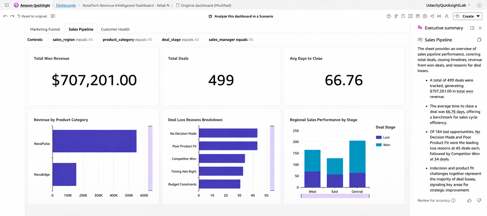

# 🤖 Dashboard Executive Summary (Auto-Generated by Amazon Quick Generative BI)

**Generated Upon Dashboard Publication**: August 2026  
**Dashboard Name**: `NovaTech Revenue Intelligence Dashboard - Nihal N`  
**Active Sheet Scoped**: `Sales Pipeline`  
**Screenshot Deliverable**: [Dashboard Executive Summary.png](./step6_dashboard_executive_summary.png)

---

## 📝 Auto-Generated Executive Summary Text

> **Sales Pipeline**
>
> The sheet provides an overview of sales pipeline performance, covering total deals, closing timelines, revenue from won deals, and reasons for deal losses.
>
> * **Total Volume & Won Revenue**: A total of 499 deals were tracked, generating **$707,201.00** in total won revenue.
>
> * **Sales Cycle Efficiency**: The average time to close a deal was **66.76 days**, offering a benchmark for sales cycle efficiency.
>
> * **Opportunity Loss Drivers**: Of 184 lost opportunities, **No Decision Made** and **Poor Product Fit** were the leading loss reasons at 43 deals each, followed by **Competitor Won** at 34 deals.
>
> * **Strategic Implication**: Indecision and product-fit challenges together represent the majority of deal losses, signaling key areas for strategic improvement.

---

## 📸 Visual Evidence

---